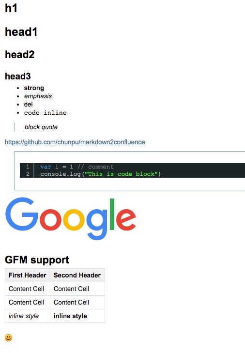

markdown2confluence
===

[![Build status][travis-image]][travis-url]
[![NPM version][npm-image]][npm-url]
[![Downloads][downloads-image]][downloads-url]
[![Dependency Status][david-image]][david-url]

[npm-image]: https://img.shields.io/npm/v/markdown2confluence.svg?style=flat-square
[npm-url]: https://npmjs.org/package/markdown2confluence
[downloads-image]: http://img.shields.io/npm/dm/markdown2confluence.svg?style=flat-square
[downloads-url]: https://npmjs.org/package/markdown2confluence
[david-image]: http://img.shields.io/david/chunpu/markdown2confluence.svg?style=flat-square
[david-url]: https://david-dm.org/chunpu/markdown2confluence


convert markdown to confluence markup

Installation
---

```sh
npm i markdown2confluence -g
```

Usage
---

```sh
markdown2confluence markdown.md
```

or

Try in browser <http://chunpu.github.io/markdown2confluence/browser/>

Document
---

[Confluence Wiki Markup](https://confluence.atlassian.com/display/CONF42/Confluence+Wiki+Markup)



License
---

[![License][license-image]][license-url]

[travis-image]: https://img.shields.io/travis/chunpu/markdown2confluence.svg?style=flat-square
[travis-url]: https://travis-ci.org/chunpu/markdown2confluence
[license-image]: http://img.shields.io/npm/l/markdown2confluence.svg?style=flat-square
[license-url]: #
